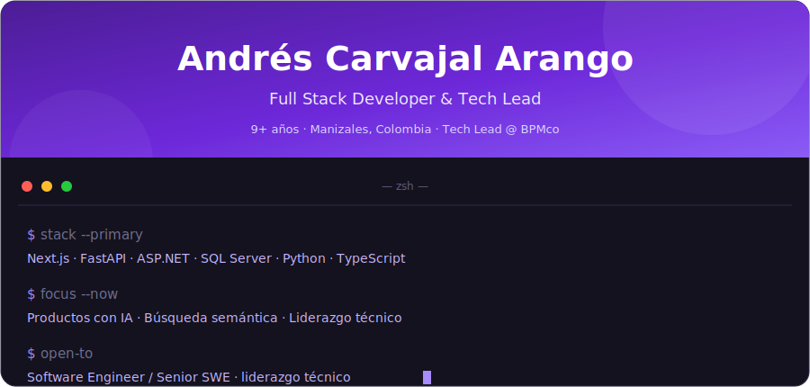

<!-- ══════════════════════════ HEADER ══════════════════════════ -->

  

---

<!-- ══════════════════════════ ABOUT ══════════════════════════ -->
## Sobre mí

Desarrollador full stack con **más de 9 años** construyendo software empresarial. Actualmente lidero un equipo en **BPMco**, donde trabajamos en **sistemas BPM** (automatización de procesos, formularios y flujos de negocio) sobre ASP.NET, SQL Server y Vue. En paralelo desarrollo proyectos propios como **MejorDicho!**, explorando Next.js, FastAPI e integración de IA.

- Trabajo end-to-end: desde el modelado de datos hasta la experiencia final del usuario.
- Me gusta integrar IA en producto de forma útil (p. ej. búsqueda semántica con Claude).
- Combino la parte técnica *hands-on* con la gestión de equipo, clientes y proyectos.
- Impulsé la migración del control de versiones del equipo de SVN a GitHub.

---

<!-- ══════════════════════════ TECH STACK ══════════════════════════ -->
## Stack técnico

**Lenguajes**

**Frontend**

**Backend y bases de datos**

**Cloud, DevOps y tooling**

---

<!-- ══════════════════════════ EXPERIENCE ══════════════════════════ -->
## Experiencia

### Full Stack Developer &amp; Tech Lead — BPMco
*Manizales, Colombia*

Lidero un equipo de desarrollo combinando ejecución técnica con gestión de personas y proyectos. Construimos **sistemas BPM** (Business Process Management) para clientes: automatización de procesos, formularios dinámicos y flujos de negocio.

- Desarrollo full stack sobre ASP.NET (Web Forms), SQL Server, Vue.js y JavaScript.
- Experiencia adicional en desarrollo móvil (Java, Objective-C).
- Lideré la migración del control de versiones del equipo de SVN a GitHub.
- Gestión de proyectos, comunicación con clientes y liderazgo de equipo.

`ASP.NET` · `SQL Server` · `Vue.js` · `JavaScript` · `BPM` · `Team Leadership`

---

<!-- ══════════════════════════ FEATURED PROJECTS ══════════════════════════ -->
## Proyectos destacados

### MejorDicho! — Plataforma de cultura popular colombiana

Plataforma para **preservar y compartir la cultura popular colombiana** (dichos, refranes y piropos), organizada por los 33 departamentos del país. La diseñé, desarrollé y desplegué de punta a punta.

| Aspecto | Detalle |
|---|---|
| **Stack** | Next.js 14 (App Router) · FastAPI · PostgreSQL |
| **Cobertura** | Los 33 departamentos de Colombia |
| **Infraestructura** | PWA instalable · Nginx + Gunicorn · CI/CD |
| **IA** | Búsqueda semántica sobre contenido en PostgreSQL (Claude) |
| **Enlace** | [mejor-dicho.com](https://mejor-dicho.com) |

Incluye un mapa interactivo de Colombia para explorar por región, búsqueda semántica con IA y un sistema social de reacciones, comentarios y ranking. Un proyecto end-to-end, desde el diseño de la base de datos hasta el despliegue en producción.

---

<!-- ══════════════════════════ AI / ML ══════════════════════════ -->
## Experiencia en IA

| Dominio | Detalle |
|---|---|
| Integración de LLMs | Integración de la Claude API en producto (MejorDicho!). |
| Búsqueda semántica | Búsqueda impulsada por IA sobre contenido en PostgreSQL. |
| Producto con IA | Diseño de features de IA con foco en la experiencia de usuario. |
